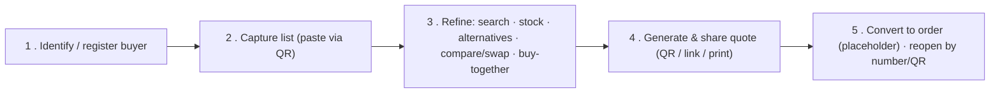
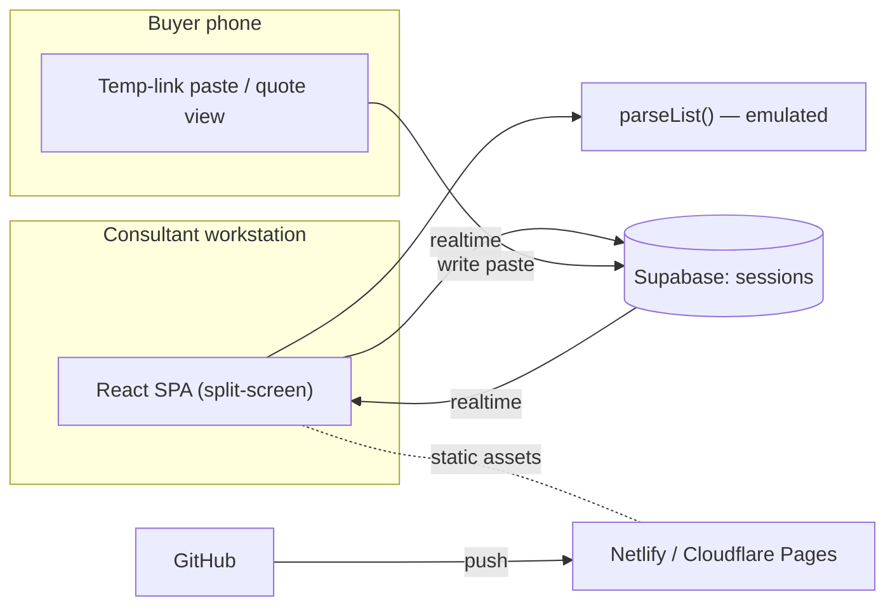

# CPQ Guided Selling — Prototype Spec (Demo + MVP Demo)

> **Status:** Throwaway demo prototype. Built to be shown once, then discarded.
> **Audience for the demo:** Product stakeholders evaluating a CPQ / guided-selling direction for Creatio.
> **Source of truth:** The **Demo Scenarios** (§6) and the **Discovery / CJM tables** (§4–§5). Everything else serves them.
> **Build target:** Implementable by Lovable / Codex / Claude Code in ~1 day with mock data.

---

## 1. What this is (and isn't)

A **guided-selling + quote-building prototype** in which a **Store Consultant** helps a **Buyer** turn messy input into a complete, priced, shareable quote — fast, modern, AI-assisted, and reusable as a generic CPQ pattern (not a one-off retail mockup).

The walkthrough uses a **Home Depot-style consultant helping a contractor buy materials for a flat renovation**, but this is **only an illustrative example**. All features and UI must be **universal / domain-agnostic** — any catalog, any account, any project.

**This is a prototype, not the product.** Mock catalog, mock inventory, mock accounts, simplified quote logic. No real payment, checkout, fulfillment, approvals, pricing-rule admin, analytics, or inventory integration.

---

## 2. Goals & metrics

| | Goal | How the prototype shows it |
|---|---|---|
| **Primary** | Increase **average check / order value** | Completeness + relevance: *They buy together* additions, *Alternatives* upgrades — never random upsell |
| Secondary | Faster, smoother quote process | Paste-to-parse intake, split-screen build, one-click quote |
| Secondary | Consultant efficiency + buyer trust | Guided flow, human-in-control review, reason-labelled suggestions, never-silently-broken quotes |

**Design principle that frames pricing:** prices are **rule-based** (price lists), never typed by the consultant. The prototype shows this with a **default price list vs a buyer-specific price list** + eligibility badge — not a full pricing engine.

---

## 3. Scope tiers

The board describes a **full MVP**. This spec builds a **scoped Demo Prototype** that demonstrates the MVP through the 5 scenarios. Three tiers:

| Tier | Meaning | In this build? |
|---|---|---|
| **Demo Prototype** | What we build and show tomorrow | ✅ Yes — see §6, §13 |
| **Full MVP** | The complete first release (the board) | 📋 Reference only (§5) |
| **Post-MVP** | Deferred | ❌ Out (§5, §14) |

---

## 4. Discovery mapping (tables)

Cleaned/structured version of the discovery board: **Stakeholder → Expectation/Job → Feature → Screen / UI state.**

### 4.1 Buyer (Contractor / Foreman)
| Expectation / Job | Feature | Screen / UI state |
|---|---|---|
| My account & pricing recognised when I arrive | Lookup by phone/email/ID; buyer-specific price list + eligibility badge | Identify-buyer bar |
| I come with messy input, not a clean list | Paste via QR temp link → LLM parse → catalog match | Buyer phone: paste screen → reconciliation list |
| I want to see real options (photos, specs, price) | Tile + list/table views; rich product detail | Catalog (split-screen) · Product detail overlay |
| Confidence nothing important is missing | *They buy together* (same style / work together) | Full-screen *They buy together* overlay |
| Useful options, not random upsells | *Alternatives* (better price / better quality / same style); reason = the tab name | Full-screen *Alternatives* overlay |
| Out-of-stock shouldn't block my quote | Keep item flagged *unavailable*; or swap to an in-stock alternative | Quote line state · Alternatives · Compare |
| A clear quote I can share and act on later | Quote with number + validity; share via QR/link/email; print | Quote view · Buyer phone: quote view |

### 4.2 Store Consultant
| Expectation / Job | Feature | Screen / UI state |
|---|---|---|
| Find or quickly create the buyer | Account/contact lookup + simple register | Identify-buyer bar · Register form |
| Find the right products fast | Search + autocomplete; filter & sort by all params | Catalog (split-screen) |
| Add complete, relevant extras without pushiness | *View related* → Alternatives / They buy together; I approve each add | Recommendation overlays |
| Stock gaps shouldn't stall me | Availability indication; keep-with-flag; swap to in-stock | Quote line state · Alternatives |
| A live workspace to shape the quote | Editable lines, qty edit, running total, notes, buyer context | Live quote panel (split-screen) |
| Don't hand-set prices | Prices from price list (default vs buyer-specific) | Quote line pricing |
| Hand off a professional quote in one click | One-click generate → share / print | Quote view |

### 4.3 Home Depot-style Business Stakeholder *(example persona)*
| Expectation / Job | Feature | Screen / UI state |
|---|---|---|
| Grow average check through completeness, not pressure | They-buy-together + alternatives, reason-labelled by tab | Recommendation overlays |
| No pushy/irrelevant upsells | Relevance-ranked, consultant-approved only | Recommendation overlays |
| Fast, trustworthy consultation | Paste-to-parse + guided split-screen, human-in-control | Whole flow |
| Don't let availability kill the sale | Keep-with-flag + swap-to-in-stock | Quote line · Alternatives |
| Easy to convert to a purchase later | Retrievable quote (number/QR) → convert-to-order placeholder | Quote view · Order confirmation |

### 4.4 Creatio Product / Engineering
| Expectation / Job | Feature | Screen / UI state |
|---|---|---|
| Reusable CPQ guided selling, not a one-off | Generic engine; configurable catalog/relationships/price lists | All — domain-agnostic |
| Simple, standard CPQ data model | `Account/Contact → Quote → Quote Lines` (+ mock catalog/price lists) | §8 |
| Recommendation logic visible & explainable | Deterministic relationships + tab-as-reason-label | §9 |
| Prices rule-based, not arbitrary | Two mock price lists + eligibility badge; no free-typing | Quote pricing |
| Realistic to build with Lovable/Codex/Claude Code | Mock data; no checkout/payment/fulfillment | §11 |

---

## 5. Customer Journey Map — MVP vs Post-MVP (tables)

CJM stages: **1. Buyer identification/registration → 2. Intake & review → 3. List refinement → 4. Quote generation → 5. Order generation.**

| CJM stage | **MVP (full first release)** | **Post-MVP (deferred)** |
|---|---|---|
| **1. Buyer ID / register** | Identify by phone/email/ID; simple register; **default vs buyer-specific pricing + eligibility badge** | Guided wizard; identify via buyer app |
| **2. Intake & review** | **Buyer paste via QR temp link → LLM parse**; **consultant paste variant (same engine)**; search + autocomplete; tile + list/table view w/ qty·price·totals; filter by all params; sort by all params; rich product detail | LLM **chat** intake; fuzzy/semantic search; buyer app multi-input / paste / 360-scan / photo-search; NL+photo intake w/ smart follow-ups |
| **3. List refinement** | Add/remove + qty edit; **availability indication (keep-with-flag)**; **Alternatives** (better price/quality, same style); **They buy together** (same style, work together); add from recommendations; **Compare**; **Swap** | Project/category **checklist** ("missing essentials"); explained-suggestion chips*; **split quantity** handling; ship-to-store; bulk select; in-shop item-location; one-click selected↔alt swap |
| **4. Quote generation** | One-click quote (review-friendly); quote view; print; share via email; share via QR/link | Share via buyer app |
| **5. Order generation** | Create order from quote (**placeholder** payment + fulfillment); **retrievable quote by number/QR** (convert-to-order hand-off) | Create order with **real** payment + fulfillment |

\* *Reason labels are partly satisfied in MVP because the **tab/sub-tab name is the reason** (e.g. "better quality", "work together").*

---

## 6. Demo Scenarios — the source of truth

**Cross-cutting model**
- **Two surfaces:** **Consultant workstation** (primary, split-screen) + **Buyer phone** via **QR temp link** (no login, expiring) — used only to *paste a list in* and *view a quote out*. No full buyer app.
- **One spine:** `Account/Contact → Quote (draft → finalized) → Quote Lines`. The "list" **is** the quote in draft status.
- **Human-in-control:** the intake parser proposes (emulated in the demo); the consultant approves every line. Nothing auto-commits to the quote.



### Scenario 1 — Identify or register the buyer
- **Surface:** Consultant workstation · **CJM:** 1
- **Trigger:** buyer arrives at the desk.
- **Flow:**
  1. Consultant searches by **phone / email / ID**.
  2. **Match →** opens/creates a **draft quote linked to the account**; **prices switch from default to the buyer-specific list**; eligibility badge appears.
  3. **No match →** quick **register** (phone/email) → same outcome.
- **Anytime:** identification is a **top-right header action available throughout** — re-identifying or switching buyer at any point, even after the quote is generated, **re-prices all lines**. The scenario order is the common path, not a hard gate.
- **End state:** a draft quote exists, linked to a buyer, priced on the buyer-specific list.
- **Demo acceptance:** searching a known number resolves an account and the price column visibly changes vs anonymous.

### Scenario 2 — Capture the buyer's existing list (paste via temp link)
- **Surfaces:** Buyer phone (paste via QR) + Consultant workstation (review) · **CJM:** 2
- **Trigger:** buyer has a messy list (WhatsApp / email / notes).
- **Flow:**
  1. Consultant shows a **QR** → buyer opens the **temp link** on their phone.
  2. Buyer **pastes** their list → **parsed + mapped to the mock catalog** (emulated parse, §10).
  3. Parsed lines appear on the consultant screen with **match confidence**: confident → auto-added; fuzzy → pick from 2–3; **unmatched → flagged, never silently dropped**.
  4. Consultant + buyer **review** items + metadata (price, pack, availability) and **open the detailed view** for some.
- **Variant (same engine):** consultant pastes the list themselves if the buyer forwarded it.
- **End state:** a reviewed draft list of catalog-matched items in the quote.
- **Demo acceptance:** a messy pasted block becomes structured, catalog-matched line items with at least one fuzzy and one unmatched case handled visibly.

### Scenario 3 — Refine the list
- **Surface:** Consultant workstation (buyer alongside) · **CJM:** 3
- **Flow:**
  1. **Search & add** more items; **remove** some previously added.
  2. For **unavailable** items: **keep in the list flagged "unavailable"** *or* open **View related** (split overlay) → on the **Alternatives** tab pick a substitute → (optional) **Compare** → **Swap** to an available/better item.
  3. In the same overlay, switch to the **They buy together** tab → **Add** companions.
  4. Running total updates live throughout.
- **End state:** a complete, refined list; no silent drops; totals current.
- **Demo acceptance:** an out-of-stock line is (a) keepable with a flag and (b) swappable to an in-stock alternative via Compare; a *They buy together* add raises the total.

### Scenario 4 — Generate & share the quote
- **Surfaces:** Consultant workstation + buyer phone (quote view) · **CJM:** 4
- **Flow:**
  1. **One-click generate quote** (review-friendly) → quote gets **number + validity date**.
  2. **Share via QR/link** (buyer opens on phone) and/or **email**; **print**.
  3. Buyer is left with **clear next actions**.
- **End state:** buyer holds a **retrievable quote (number/QR)** and knows the next step.
- **Demo acceptance:** quote renders with number + validity; QR opens the same quote on a phone; print produces a clean layout.

### Scenario 5 — Convert quote to order (placeholder hand-off)
- **Surface:** Consultant workstation · **CJM:** 5
- **Flow:** reopen quote by **number/QR** → **Create order** → **order-readiness check** flags any problem lines inline (tiny per-row marker: unavailable, or swapped to a different spec/quality than originally requested) → consultant resolves or proceeds → **placeholder** payment + fulfillment → confirmation.
- **End state:** an order-created confirmation screen. **No real checkout.**
- **Demo acceptance:** reopening by number returns the same quote; "Create order" runs the readiness check (at least one line shows a tiny mismatch marker), then produces a placeholder confirmation with the quote's lines and total.

---

## 7. Screens & UI states

> The token-preview mockup was illustrative only. Authoritative placement below.

**Badge placement (NOT a chip cluster above the list):**
- **Buyer / account badges** (VIP, Pro pricing eligible) live in the **buyer-context header**, tied to the identified account.
- **Availability badges** (in stock / low / out) live **per product row** (catalog list + quote line) — never as a global header chip.

| Screen / state | Surface | Notes |
|---|---|---|
| **App shell** | Consultant | Creatio shell: dark nav rail + top bar + light content. **Nav rail collapses 240↔64px (icons only) via the top-left button.** |
| **Identify buyer (header, top-right)** | Consultant | A **top-right header button/icon, available any time** (even after the quote is generated). Search phone/email/ID; result card; register form; eligibility badge in buyer-context header. **Changing the buyer re-prices the whole quote** from the applicable price list |
| **Split-screen workspace** | Consultant | **Left:** search + filters + **view toggle (tiles ↔ list/table)**. **Right:** live quote (lines, qty, unit + ext price, running total, buyer context, notes). Header holds the **identify-buyer button** + Save; **Print/Share are Quote-view actions, not here** |
| **List / table view (dense)** | Consultant | Compact, **small font (~12–13px)**, tight rows, **many metadata columns** (SKU · name · brand · category · colour/style · pack/unit · coverage · price · availability · rating · row actions incl. **View related**). Horizontal scroll on overflow. Tiles view for visual browsing |
| **Product detail overlay** | Both | Large photo, key specs, SKU, unit/pack, coverage/dimensions, availability, rating, install/compatibility notes |
| **View related (split overlay)** | Consultant | **Triggered by a "View related" icon on a row.** Full-screen split: **left = selected item detail**; **right = related items (tiles or list)** with a **tab + sub-tab filter bar on top** — **Alternatives** (better price · better quality · same style → **Swap**) and **They buy together** (same style · work together → **Add**). Select 2–4 → **Compare**. Running total stays visible |
| **Compare** | Consultant | **Full-screen**, 2–4 items side-by-side (photos + specs); action = **Swap** (or Add) |
| **Quote view** | Both | Number, validity date, buyer/account, lines, totals, notes; **share (QR/link/email) · print**; **Create order** action runs the order-readiness check (below) |
| **Order-readiness flags** | Consultant | On **Create order**, each line is re-validated; any problem line (unavailable, or **swapped to a different spec/quality** than originally requested) shows a **tiny inline marker on that row** — not a blocking banner. Consultant resolves or proceeds |
| **Buyer phone: paste** | Buyer | Temp-link landing → paste box → "sent to consultant" state |
| **Buyer phone: quote view** | Buyer | Read-only quote + next actions |
| **Order confirmation** | Consultant | Placeholder payment + fulfillment; quote lines + total |

**Overlay vision (decided):** *View related* is **one full-screen split** — selected item on the left, related items with **Alternatives / They-buy-together tab+sub-tab filters** on the right; *Compare* is full-screen. The running quote total stays visible so adds/swaps show their effect immediately.

**Creatio process bar (kept):** a slim green Creatio stage indicator with **three stages — Catalogue › Quote › Order** — reflecting the consultant's current phase (build list → quote → order). Display-only, non-clickable.

**Universality:** no domain-specific grouping or templates are hard-coded. Line grouping (if shown) is a generic, optional field — not "room/phase".

---

## 8. Data model

**Conceptual (the CPQ spine — keep it visible in the demo):**

```
Account ──< Contact
Account ──< Quote ──< QuoteLine >── Product
PriceList (default | buyer-specific) ── Product  (unit price)
```

| Entity | Key fields |
|---|---|
| **Account** | id, name, type, phone, email, externalId, priceListId (default vs buyer-specific), eligibilityBadge |
| **Contact** | id, accountId, name, phone, email |
| **Product** | sku, name, category, brand, color, style, imageUrl, specs{}, unit, packSize, coverage, rating, priceDefault, priceBuyer, stockQty, alternatives[], buyTogether[] |
| **Quote** | id, number, accountId, contactId, status(draft→shared→ordered), validUntil, notes, createdAt |
| **QuoteLine** | id, quoteId, sku, name, qty, unitPrice, extPrice, availabilityState(available\|unavailable\|swapped), originalSku, note |

**Pragmatic storage for the demo:**
- **Static (in-repo JSON/TS):** `Account`, `Contact`, `Product` (catalog + relationships + 2 prices + stock), `PriceList`. No DB needed for these.
- **Supabase (cross-device + live):** one `sessions` table — `{ id text pk, data jsonb, updated_at }` — holding the whole draft quote (text id also stores `cpq:quote:<id>` keys for shared quotes). The temp link = `/t/{session.id}`; the QR encodes that URL. Consultant subscribes to Realtime changes on the row. (Optionally also seed `quotes`/`quote_lines` tables to make the data-model story literal.)

---

## 9. Recommendation & stock logic (deterministic, mock-driven)

Keep it rule-based and explainable — no ML needed for the demo.

- **Each product carries hardcoded relationships:**
  - `alternatives[]` — each entry tagged `better_price | better_quality | same_style` (drives the *Alternatives* sub-tabs; action = Swap).
  - `buyTogether[]` — each entry tagged `same_style | work_together` (drives *They buy together*; action = Add).
- **Reason label = the tag/sub-tab name** (no separate chips needed).
- **Availability** from `stockQty`: `0 → unavailable`. An unavailable line is **kept and flagged**; *Alternatives* surfaces in-stock options first (sorted in-stock → rating).
- **Pricing:** `unitPrice = account.priceListId === 'buyer' ? priceBuyer : priceDefault`. **Identification is available anytime** (header, top-right); changing the buyer **re-prices every line and recomputes totals** — even after the quote is generated. Consultant cannot edit unit price.
- **Swap:** replaces the line, **carries the quantity, re-prices from the active price list, updates totals**, clears the availability flag, and **keeps `originalSku`** so a spec/quality difference can be flagged later.
- **Add (buy-together):** new line at active price; consultant confirms.
- **Order-readiness (at "Create order"):** re-validate each line; show a **tiny inline marker** on any line that is `unavailable` *or* was swapped to a different quality tier than `originalSku`. Non-blocking — consultant resolves or proceeds.

---

## 10. Intake parsing (Scenario 2) — emulated for the demo

> **Demo decision:** no real LLM. The "AI parse" is **emulated** — a fixed sample input maps to a hardcoded interpreted result, so the flow is deterministic and needs no API key or network. (The real Claude call is the Full-MVP implementation — see §5 / §14.)

- **Input:** a **fixed sample paste** (the buyer's "messy list") — see §12.
- **Output:** a **hardcoded parsed result** — array of `{ rawLine, sku | null, name, qty, confidence: "high" | "low" }` — including at least one `low` (fuzzy) and one `sku: null` (unmatched) case so the reconciliation UI is exercised.
- **UI reconciliation (unchanged):** `high` → auto-added; `low` → "pick from candidates"; `sku null` → "unmatched, search manually". Nothing dropped silently.
- **Swap-in point:** keep the parse behind a single `parseList(text)` function so a real LLM call can replace the emulation later without touching the UI.

---

## 11. Tech stack, architecture & deployment

| Layer | Choice | Why |
|---|---|---|
| **Frontend** | **Vite + React + TypeScript + Tailwind + shadcn/ui** | Polished UI fast; Lovable-native; builds to static — deployable anywhere |
| **State** | React + a light store (Zustand) | Simple live-quote state |
| **Cross-device** | **Supabase** — Postgres + Realtime (anon key, client-side) | One tiny table powers the QR temp link. No edge function (parse is emulated). Free tier |
| **Intake parse** | **Emulated** (fixed sample → hardcoded result) | No API key, no network, deterministic demo (§10) |
| **Hosting (frontend)** | **Netlify** *(or Cloudflare Pages)* | Static deploy; GitHub push → auto-deploy. **Vercel excluded** (account paused) |
| **Source control** | **Git local + GitHub** | GitHub connected to host for automated deploy |
| **QR** | `qrcode.react` (client) | Encodes the temp-link / quote URL |



**Backend (confirmed): Supabase.** Only the cross-device temp link needs a backend — one `sessions` table + Realtime, used client-side with the anon key. No edge function (parse is emulated). If your free org's 2-project slot is taken, delete an unused project or spin a new free org. Catalog/accounts stay static, so the temp link is the only thing touching the backend.

**Setup checklist (the only accounts you need):**
1. A Supabase project (free) — URL + anon key + one `sessions` table (`id text`, `data jsonb`, `updated_at`).
2. GitHub repo → connect to **Netlify** (or Cloudflare Pages) for push-to-deploy.

---

## 12. Mock data seed (illustrative — keep generic)

- **Accounts:** (a) "Acme Renovations" — buyer-specific price list + eligibility badge; (b) anonymous/default.
- **Catalog (~8–12 products)** built around one demoable chain, e.g.:
  - `TILE-CER-300` Ceramic floor tile — `alternatives`: `TILE-POR-300` (better_quality), `TILE-CER-300B` (better_price), `TILE-CER-300S` (same_style); `buyTogether`: `ADH-20` (work_together), `GROUT-5` (work_together), `SPACER-100` (work_together), `TROWEL-1` (work_together).
  - Include **one out-of-stock** item (`stockQty: 0`) with an in-stock alternative, to drive Scenario 3.
- **Two price lists:** default vs buyer-specific (buyer ~8–12% lower on eligible items).
- **Emulated intake pair (§10):**
  - *Sample paste:* `"12 boxes ceramic floor tile 30x30, grout grey ~5kg, tile spacers, 2 trowels, waterproof membrane"`
  - *Hardcoded result:* tile → `TILE-CER-300` (high, qty 12) · grout → `GROUT-5` (high) · spacers → `SPACER-100` (low: pick size) · trowel → `TROWEL-1` (high, qty 2) · membrane → `null` (unmatched → manual search).

> The chain is just a vehicle for the demo. The engine reads relationships from data — swap in any catalog.

---

## 13. Build plan for the demo (priority cut-lines)

| Priority | Scope | If time is short |
|---|---|---|
| **P0 — spine** | Scenarios 1→4 happy path on the consultant workstation; split-screen; Alternatives + They-buy-together overlays; Compare + Swap; one-click quote; print | Buyer "phone" = second browser window |
| **P1** | Real cross-device temp link via Supabase + QR; emulated paste-parse | Buyer "phone" = second browser window if QR/Supabase slips |
| **P2** | Scenario 5 (order placeholder) + reopen-by-number/QR | Static confirmation screen |
| **Nice-to-have** | Email share | `mailto:` or a "sent" toast |

**Demo-safety:** keep one **pre-pasted sample list** and one **pre-identified buyer** ready so the flow can run even if live input fails.

---

## 14. Explicitly out of scope (prototype)

Real payment/checkout/fulfillment · delivery scheduling · approval workflows · pricing-rule admin · discount engine · analytics dashboards · real inventory integration · full buyer app · authentication/SSO · split-quantity fulfillment · missing-essentials project checklist · LLM chat intake · **real LLM intake parse (emulated in the demo — §10)** · photo/360/barcode/voice input. *(All are Full-MVP or Post-MVP per §5.)*

---

## 15. Open items to confirm before/after demo
- ✅ Backend: Supabase · ✅ Intake: emulated (no LLM) · ✅ Host: not Vercel.
- Host pick: **Netlify** (recommended) vs Cloudflare Pages.
- New nav item: add **CPQ** module to the Creatio-style shell (recommended) — confirm label.
- Overlay style: **total-bar overlay** for Alternatives / They-buy-together + **full-screen Compare** (recommended).

---

## 16. Visual style — Creatio Freedom UI

The prototype must **look and feel like Creatio Freedom UI**, presented as a **new module inside a Creatio-style shell** (recommended — it sells "native Creatio CPQ capability" to stakeholders).

- **Design tokens:** [`design/tokens.css`](design/tokens.css) (canonical hex + shadcn HSL mapping). Full rationale, component specs, and app-shell guidance in [`design/DESIGN.md`](design/DESIGN.md).
- **App shell:** dark left **nav rail** (240px, colored app icons) + dark **top bar** (global search, AI, icons, avatar) + light **content area** (white cards on `--c-bg`). Optional right **contextual panel**.
- **New nav item:** add **"CPQ"** (icon colour `--c-app-cpq`) to the rail; selecting it opens the consultant workspace. Other items (Accounts, Contacts, Opportunities, Orders, Products, Invoices) are **static mock** — they make the shell believable and tie to the CPQ data model.
- **Signature cues:** blue primary buttons/links (`--c-primary`); **orange-red active-tab underline** + section-marker squares (`--c-accent`); **green chevron stage/status** (`--c-stage` / `--c-success`); pill chips for tags/badges; white cards with hairline borders + soft shadow; Inter typography with small grey field labels.
